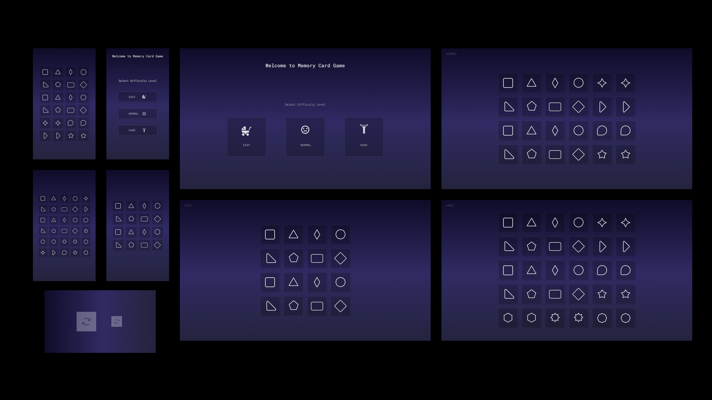

# Memory Game
Play Now! https://jesusaguilaraliaga.github.io/Memory-Game/
> audio del click en las cartas desactivado en móvil, debido al retraso que tienen los navegadores para móvil de 300ms, da una mala experiencia el lag que hay :(

## (ES)

## Tecnologías usadas

* JavaScript
* CSS 
* HTML

## ¿Cómo se hizo?

Hola, para empezar este proyecto, primero hice los diseños en Figma.

Luego empece a pensar en como lo haría, tenía en mente hacer un index.html para cada nivel del juego, pero se me hacía muy complicado entrelazar archivos, además de crear diferentes archivos CSS.
Luego pensé en generar todo en el mismo index.html, y ocultar y mostrar los distintos niveles, pero en el archivo JavaScript se llenó de declaraciones(if).

Buscando una manera más limpia, leyendo algunos artículos, me encontré con este 
https://www.webtips.dev/memory-game-in-javascript
una forma en la que hizo el juego más limpio y usando emojis para las tarjetas(ya que con imágenes el código se hace demasiado largo, se podría, pero yo andaba buscando algo más limpio), fui investigando el soporte de los emojis en los diferentes navegadores, para no tener problemas.

Al ver que el soporte era bueno, decidí hacerlo con emojis, en el artículo describen además una manera de cambiar aleatoriamente los emojis, sin pensarlo decidí llevarlo a código, tuve algunos problemas en el camino, uno de los que más me llevo trabajo fue trabajando en el diseño responsivo para móviles, ya que el tamaño lo pone JavaScript, y no podía modificarlo con CSS, luego de mucha investigación, hice una función para que al cambio de tamaño de pantalla las tarjetas cambien de tamaño (sin CSS), y así logre que el tamaño de las tarjetas cambien!

Sobre la base del artículo, mejore y añadí un montón de cosas, haciéndolo más a mi estilo y los requerimientos del proyecto,
trate de reducir el código lo máximo posible para que sea entendible.

## (EN)
> audio of the click on the cards disabled on mobile, due to the delay that mobile browsers have of 300ms, the lag that there is gives a bad experience :(

## Technologies

* JavaScript
* CSS 
* HTML

## ¿How it was made?

Hello, to start this project, I first made the designs in Figma.

Then I started to think about how I would do it, I had in mind to make an index.html for each level of the game, but it was very difficult for me to intertwine files, in addition to creating different CSS files.
Then I thought about generating everything in the same index.html, and hiding and showing the different levels, but in the JavaScript file it was full of (if) statements.

Searching for a cleaner way, reading some articles, I came across this
https://www.webtips.dev/memory-game-in-javascript
a way in which it made the game cleaner and using emojis for the cards (because with images the code becomes too long, it could, but I was looking for something cleaner), I was investigating the support of emojis in the different browsers, to avoid problems.

Seeing that the support was good, I decided to do it with emojis, in the article they also describe a way to randomly change the emojis, without thinking about it I decided to take it to code, I had some problems along the way, one of the ones that took me the most work was working in the mobile responsive design, since the size is set by JavaScript, and I couldn't modify it with CSS, after a lot of research, I made a function so that when the screen size is changed, the cards change size (without CSS), and so on make the size of the cards change!

Based on the article, I improved and added a lot of things, making it more to my style and the requirements of the project,
try to reduce the code as much as possible to make it understandable.

(ES)

Hola, para empezar este proyecto, primero hice los diseños en Figma.

Luego empece a pensar en como lo haría, tenía en mente hacer un index.html para cada nivel del juego, pero se me hacía muy complicado entrelazar archivos, además de crear diferentes archivos CSS.
Luego pensé en generar todo en el mismo index.html, y ocultar y mostrar los distintos niveles, pero en el archivo JavaScript se llenó de declaraciones(if).

Buscando una manera más limpia, leyendo algunos artículos, me encontré con este 
https://www.webtips.dev/memory-game-in-javascript
una forma en la que hizo el juego más limpio y usando emojis para las tarjetas(ya que con imágenes el código se hace demasiado largo, se podría, pero yo andaba buscando algo más limpio), fui investigando el soporte de los emojis en los diferentes navegadores, para no tener problemas.

Al ver que el soporte era bueno, decidí hacerlo con emojis, en el artículo describen además una manera de cambiar aleatoriamente los emojis, sin pensarlo decidí llevarlo a código, tuve algunos problemas en el camino, uno de los que más me llevo trabajo fue trabajando en el diseño responsivo para móviles, ya que el tamaño lo pone JavaScript, y no podía modificarlo con CSS, luego de mucha investigación, hice una función para que al cambio de tamaño de pantalla las tarjetas cambien de tamaño (sin CSS), y así logre que el tamaño de las tarjetas cambien!

Sobre la base del artículo, mejore y añadí un montón de cosas, haciéndolo más a mi estilo y los requerimientos del proyecto,
trate de reducir el código lo máximo posible para que sea entendible.

(EN)

Hello, to start this project, I first made the designs in Figma.

Then I started to think about how I would do it, I had in mind to make an index.html for each level of the game, but it was very difficult for me to intertwine files, in addition to creating different CSS files.
Then I thought about generating everything in the same index.html, and hiding and showing the different levels, but in the JavaScript file it was full of (if) statements.

Searching for a cleaner way, reading some articles, I came across this
https://www.webtips.dev/memory-game-in-javascript
a way in which it made the game cleaner and using emojis for the cards (because with images the code becomes too long, it could, but I was looking for something cleaner), I was investigating the support of emojis in the different browsers, to avoid problems.

Seeing that the support was good, I decided to do it with emojis, in the article they also describe a way to randomly change the emojis, without thinking about it I decided to take it to code, I had some problems along the way, one of the ones that took me the most work was working in the mobile responsive design, since the size is set by JavaScript, and I couldn't modify it with CSS, after a lot of research, I made a function so that when the screen size is changed, the cards change size (without CSS), and so on make the size of the cards change!

Based on the article, I improved and added a lot of things, making it more to my style and the requirements of the project,
try to reduce the code as much as possible to make it understandable.